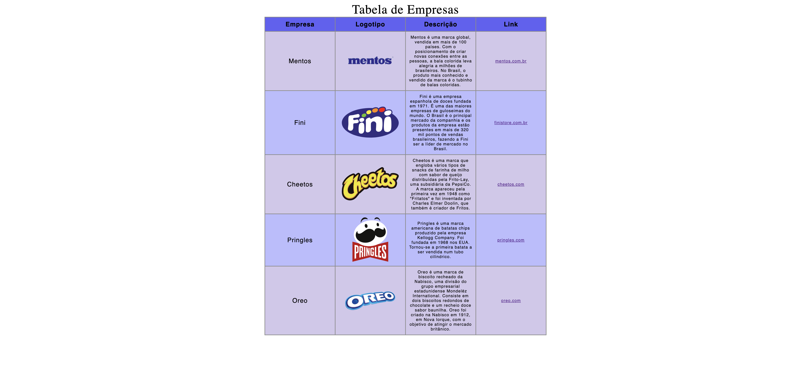

# Tabela de Empresas

---
## Sobre

Site com tabelas de empresas famosas. O objetivo desse projeto é entender conceitos básicos do HTML como o "corpo" de um código através do módulo "table" durante o curso de DS (Desenvolvimento de Sistemas) do [SENAI Jandira](https://sp.senai.br/unidade/jandira/)

## Tecnologias utilizadas

- HTML
- CSS

## Autor

- Nicolas Silva
